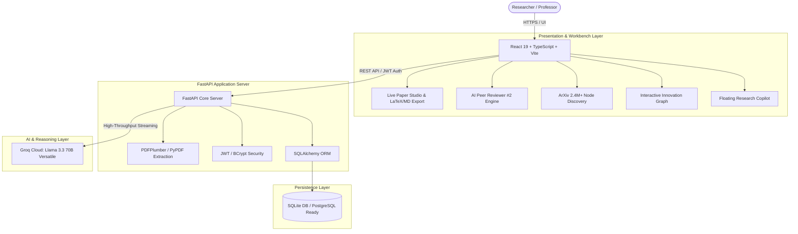

# 🌌 Research Orbit (ResearchPilot AI)

[](https://github.com/vaishnavireddy067/Research-Orbit/actions)
[](LICENSE)
[](https://react.dev/)
[](https://fastapi.tiangolo.com/)
[](https://groq.com/)
[](https://www.sqlite.org/)

> **Research Orbit** is a state-of-the-art autonomous research intelligence platform designed to help researchers, scholars, and engineers analyze literature, detect unexplored research gaps, evaluate academic rigor, and author camera-ready manuscripts at 10x velocity.

---

## 🏛️ System Architecture



---

## ✨ Flagship Capabilities

### 1. ✍️ Live Paper Studio & Manuscript Workbench
- **Real-time authoring** for complete academic structures: Abstract, Problem Formulation, Methodology, Empirical Evaluation, and References.
- **Dynamic Research Grounding**: Every section is synchronized with your active research topic to eliminate hallucinations.
- **Multi-Format Export**: 1-click export to **LaTeX (`.tex`)**, **Markdown (`.md`)**, and **Plain Text (`.txt`)**.
- **Academic Integrity Guard**: Real-time scoring of citation grounding and human academic attribution.

### 2. 👩‍🔬 Autonomous AI Peer Reviewer ("Reviewer #2")
- Unsparing academic critique simulating top-tier conference and journal reviewers.
- **Rejection Risk Profiling**: Pinpoints methodological weaknesses before formal submission.
- **Journal Tier Predictor**: Categorizes fit across Nature/Science, IEEE/ACM Transactions, Top Conferences (NeurIPS, ICML, CVPR), or Workshop tiers.
- Actionable revision checklists to maximize acceptance probability.

### 3. 🌐 Global ArXiv Literature Discovery
- Direct real-time search across **2.4 Million+ ArXiv preprints and papers**.
- Instant 1-click paper import into your central active research pipeline.
- Automatic metadata extraction, author parsing, and citation indexing.

### 4. 🕸️ Interactive Research Innovation Map
- Visualizes your research library as a dynamic **knowledge graph with physics-based node clustering**.
- Highlights thematic bridges, foundational works, and emerging cross-domain connections.

### 5. 🔍 Deep Gap Analysis & Novelty Engine
- **Failure Mode Simulator**: Simulates out-of-distribution drifts, latency constraints, and dataset biases.
- **Novelty & Impact Scoring**: Algorithmic assessment of technical originality versus prior art.
- **Weak Arguments Inspector**: Flags missing baselines, overclaimed results, and unsupported conclusions.

### 6. 🔊 AI Audio Brief (Research Podcast)
- Converts paper findings into an audio summary with speech synthesis.
- Ideal for quick auditory reviews while commuting or multitasking.

### 7. 🎓 Professor & Mentor Supervision Dashboard
- Dedicated oversight portal for research advisors to track student paper progress, review milestones, and flag submission risks.

---

## 🛠️ Technology Stack

| Layer | Technology |
| :--- | :--- |
| **Frontend** | React 19, TypeScript, Vite, Tailwind CSS, Lucide Icons, Recharts, Framer Motion |
| **Backend** | Python 3.10+, FastAPI, Uvicorn, SQLAlchemy ORM, Pydantic |
| **AI / LLM** | Groq Cloud API running Llama 3.3 70B Versatile |
| **Document Processing**| PDFPlumber, PyPDF |
| **Database** | SQLite (development) / PostgreSQL (production compatible) |
| **Authentication** | JWT Bearer Tokens with Passlib & BCrypt encryption |

---

## 🚀 Quick Start Guide

### Prerequisites
- **Node.js**: v18.0 or higher
- **Python**: v3.10 or higher
- **Groq API Key**: Free at [console.groq.com](https://console.groq.com/keys)

### 1. Clone the Repository
```bash
git clone https://github.com/vaishnavireddy067/Research-Orbit.git
cd Research-Orbit
```

### 2. Configure Environment Variables
Copy the template file to `.env`:
```bash
# On Windows PowerShell:
Copy-Item .env.example .env

# On macOS/Linux:
cp .env.example .env
```
Open `.env` and paste your Groq API key:
```env
GROQ_API_KEY=your_groq_api_key_here
DATABASE_URL=sqlite:///./research_pilot_v3.db
SECRET_KEY=generate_a_secure_random_key_here
ALGORITHM=HS256
ACCESS_TOKEN_EXPIRE_MINUTES=60
```

---

### 3. Start the Backend Server
1. Create and activate a Python virtual environment:
   ```bash
   # Windows:
   python -m venv venv
   .\venv\Scripts\activate

   # macOS / Linux:
   python3 -m venv venv
   source venv/bin/activate
   ```
2. Install dependencies:
   ```bash
   pip install -r requirements.txt
   ```
3. Run the FastAPI backend:
   ```bash
   python main.py
   # API will launch at http://127.0.0.1:8000
   # Interactive Swagger docs at http://127.0.0.1:8000/docs
   ```

---

### 4. Start the Frontend Application
Open a new terminal window in the project root:
```bash
npm install
npm run dev
# Frontend will launch at http://localhost:5173
```

---

## 🧪 Verification & Production Build

To verify production bundle compilation and type safety:
```bash
npm run build
```

---

## 📄 License
Distributed under the **MIT License**. See [LICENSE](LICENSE) for more information.

---

## 🤝 Contributing & Feedback
Contributions, issues, and feature requests are welcome! Feel free to check the [Issues](https://github.com/vaishnavireddy067/Research-Orbit/issues) page.
